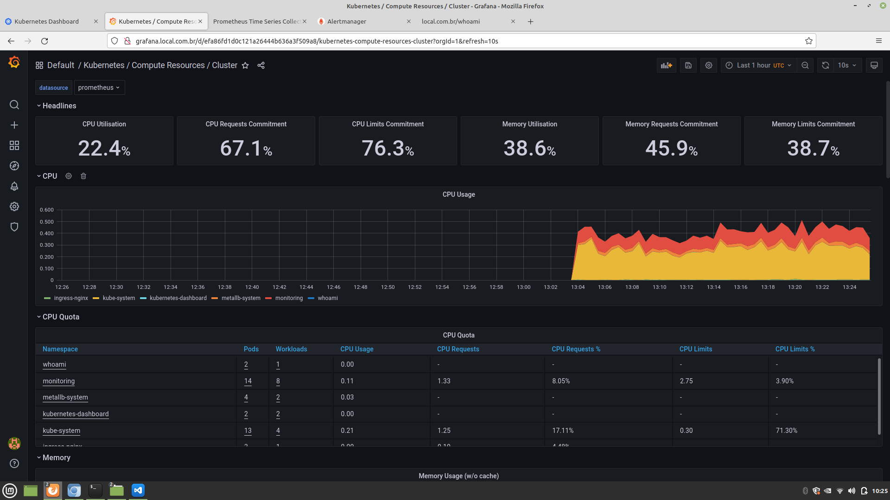
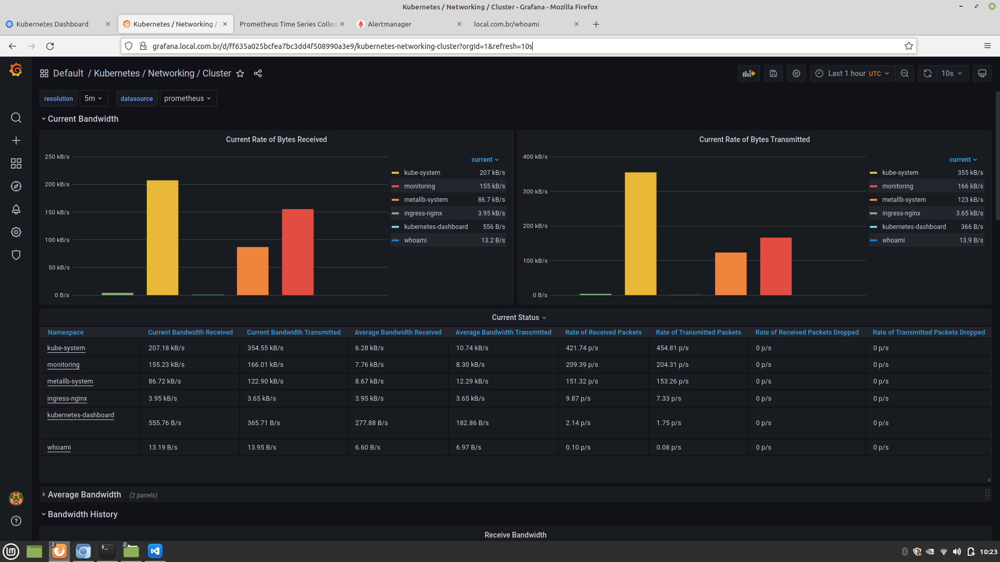
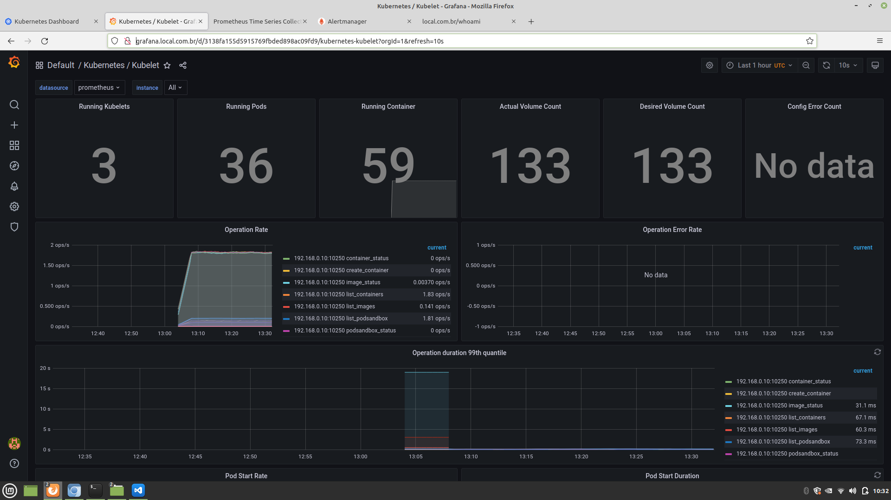

# Cluster

Load Balancer (metallb): 192.168.0.20

## SSH
```bash
$ ssh-keygen -t rsa
```

## Images

### List Images
```bash
$ sudo kubeadm config images list
```

### Pull images
```bash
$ for image in k8s.gcr.io/kube-apiserver:v1.22.2 \
k8s.gcr.io/kube-controller-manager:v1.22.2 \
k8s.gcr.io/kube-scheduler:v1.22.2 \
k8s.gcr.io/kube-proxy:v1.22.2 \
k8s.gcr.io/pause:3.5 \
k8s.gcr.io/etcd:3.5.0-0 \
k8s.gcr.io/coredns/coredns:v1.8.4; do
sudo docker pull $image;
done
```

### Save images
```bash
$ mkdir /vagrant/k8s-images
$ docker save k8s.gcr.io/kube-apiserver:v1.22.2 > /vagrant/k8s-images/kube-apiserver.tar
$ docker save k8s.gcr.io/kube-controller-manager:v1.22.2 > /vagrant/k8s-images/kube-controller-manager.tar
$ docker save k8s.gcr.io/kube-scheduler:v1.22.2 > /vagrant/k8s-images/kube-scheduler.tar
$ docker save k8s.gcr.io/kube-proxy:v1.22.2 > /vagrant/k8s-images/kube-proxy.tar
$ docker save k8s.gcr.io/pause:3.5 > /vagrant/k8s-images/pause.tar
$ docker save k8s.gcr.io/etcd:3.5.0-0 > /vagrant/k8s-images/etcd.tar
$ docker save k8s.gcr.io/coredns/coredns:v1.8.4 > /vagrant/k8s-images/coredns.tar
```

### Load images
```bash
$ cd /vagrant/k8s-images
$ ls /vagrant/k8s-images/* | while read image; do docker load < $image; done
```

### Hosts configuration
```bash
$ cat /etc/hosts
...
192.168.0.20    local.com.br
192.168.0.20    kube-dash.local.com.br
192.168.0.20    grafana.local.com.br
192.168.0.20    prometheus.local.com.br
192.168.0.20    alertmanager.local.com.br
```

## Apply provisioning-finished.yml file
```bash
$ vagrant ssh ansible
$ ansible-playbook -i /vagrant/hosts /vagrant/provisioning-finished.yml
```

## Node master tests
```bash
$ kubectl cluster-info
$ kubectl api-resources -o wide
$ watch kubectl get nodes -o wide
NAME           STATUS   ROLES                  AGE   VERSION   INTERNAL-IP    EXTERNAL-IP   OS-IMAGE             KERNEL-VERSION       CONTAINER-RUNTIME
k8s-master     Ready    control-plane,master   26m   v1.22.2   192.168.0.10   <none>        Ubuntu 18.04.6 LTS   4.15.0-159-generic   docker://20.10.7
k8s-worker-1   Ready    <none>                 23m   v1.22.2   192.168.0.11   <none>        Ubuntu 18.04.6 LTS   4.15.0-159-generic   docker://20.10.7
k8s-worker-2   Ready    <none>                 23m   v1.22.2   192.168.0.12   <none>        Ubuntu 18.04.6 LTS   4.15.0-159-generic   docker://20.10.7
$ kubectl get svc --all-namespaces
NAMESPACE              NAME                                 TYPE           CLUSTER-IP       EXTERNAL-IP    PORT(S)                        AGE
default                kubernetes                           ClusterIP      10.96.0.1        <none>         443/TCP                        9m1s
ingress-nginx          ingress-nginx-controller             LoadBalancer   10.109.196.255   192.168.0.20   80:31731/TCP,443:32521/TCP     8m52s
ingress-nginx          ingress-nginx-controller-admission   ClusterIP      10.107.56.44     <none>         443/TCP                        8m52s
kube-system            kube-dns                             ClusterIP      10.96.0.10       <none>         53/UDP,53/TCP,9153/TCP         8m59s
kube-system            kubelet                              ClusterIP      None             <none>         10250/TCP,10255/TCP,4194/TCP   110s
kube-system            metrics-server                       ClusterIP      10.107.152.162   <none>         443/TCP                        8m53s
kubernetes-dashboard   dashboard-metrics-scraper            ClusterIP      10.101.112.210   <none>         8000/TCP                       2m34s
kubernetes-dashboard   kubernetes-dashboard                 NodePort       10.108.159.162   <none>         443:31629/TCP                  2m34s
monitoring             alertmanager-main                    ClusterIP      10.108.128.192   <none>         9093/TCP                       119s
monitoring             alertmanager-operated                ClusterIP      None             <none>         9093/TCP,9094/TCP,9094/UDP     110s
monitoring             blackbox-exporter                    ClusterIP      10.98.28.159     <none>         9115/TCP,19115/TCP             119s
monitoring             grafana                              ClusterIP      10.108.62.10     <none>         3000/TCP                       117s
monitoring             kube-state-metrics                   ClusterIP      None             <none>         8443/TCP,9443/TCP              117s
monitoring             node-exporter                        ClusterIP      None             <none>         9100/TCP                       116s
monitoring             prometheus-adapter                   ClusterIP      10.96.0.91       <none>         443/TCP                        116s
monitoring             prometheus-k8s                       ClusterIP      10.110.236.18    <none>         9090/TCP                       115s
monitoring             prometheus-operated                  ClusterIP      None             <none>         9090/TCP                       110s
monitoring             prometheus-operator                  ClusterIP      None             <none>         8443/TCP                       2m
whoami                 whoami                               NodePort       10.102.45.49     <none>         80:30548/TCP                   113s
$ kubectl get pods --all-namespaces -o wide
NAMESPACE              NAME                                         READY   STATUS      RESTARTS   AGE     IP             NODE           NOMINATED NODE   READINESS GATES
ingress-nginx          ingress-nginx-admission-create--1-lhzz5      0/1     Completed   0          9m29s   10.244.1.2     k8s-worker-1   <none>           <none>
ingress-nginx          ingress-nginx-admission-patch--1-txg7v       0/1     Completed   0          9m29s   10.244.1.4     k8s-worker-1   <none>           <none>
ingress-nginx          ingress-nginx-controller-8cf5559f8-zk6v4     1/1     Running     0          9m29s   10.244.1.6     k8s-worker-1   <none>           <none>
kube-system            coredns-78fcd69978-kwjtg                     1/1     Running     0          9m28s   10.244.0.2     k8s-master     <none>           <none>
kube-system            coredns-78fcd69978-wgmg7                     1/1     Running     0          9m29s   10.244.0.3     k8s-master     <none>           <none>
kube-system            etcd-k8s-master                              1/1     Running     0          9m43s   192.168.0.10   k8s-master     <none>           <none>
kube-system            kube-apiserver-k8s-master                    1/1     Running     0          9m41s   192.168.0.10   k8s-master     <none>           <none>
kube-system            kube-controller-manager-k8s-master           1/1     Running     0          9m41s   192.168.0.10   k8s-master     <none>           <none>
kube-system            kube-flannel-ds-5p6hk                        1/1     Running     0          7m12s   192.168.0.11   k8s-worker-1   <none>           <none>
kube-system            kube-flannel-ds-q4vtn                        1/1     Running     0          7m12s   192.168.0.12   k8s-worker-2   <none>           <none>
kube-system            kube-flannel-ds-zzgw5                        1/1     Running     0          9m29s   192.168.0.10   k8s-master     <none>           <none>
kube-system            kube-proxy-gjp5l                             1/1     Running     0          7m12s   192.168.0.12   k8s-worker-2   <none>           <none>
kube-system            kube-proxy-kmmwh                             1/1     Running     0          9m29s   192.168.0.10   k8s-master     <none>           <none>
kube-system            kube-proxy-s74gh                             1/1     Running     0          7m12s   192.168.0.11   k8s-worker-1   <none>           <none>
kube-system            kube-scheduler-k8s-master                    1/1     Running     0          9m43s   192.168.0.10   k8s-master     <none>           <none>
kube-system            metrics-server-8589b99d8f-pcgsv              1/1     Running     0          9m29s   10.244.1.3     k8s-worker-1   <none>           <none>
kubernetes-dashboard   dashboard-metrics-scraper-7487b56f4c-tnvfb   1/1     Running     0          3m17s   10.244.2.3     k8s-worker-2   <none>           <none>
kubernetes-dashboard   kubernetes-dashboard-67484c44f6-gj79c        1/1     Running     0          3m17s   10.244.2.2     k8s-worker-2   <none>           <none>
metallb-system         controller-6b78bff7d9-bmsqn                  1/1     Running     0          9m29s   10.244.1.5     k8s-worker-1   <none>           <none>
metallb-system         speaker-d56sd                                1/1     Running     0          9m11s   192.168.0.10   k8s-master     <none>           <none>
metallb-system         speaker-l8lrv                                1/1     Running     0          6m22s   192.168.0.12   k8s-worker-2   <none>           <none>
metallb-system         speaker-nl9nf                                1/1     Running     0          6m32s   192.168.0.11   k8s-worker-1   <none>           <none>
monitoring             alertmanager-main-0                          2/2     Running     0          2m33s   10.244.2.9     k8s-worker-2   <none>           <none>
monitoring             alertmanager-main-1                          2/2     Running     0          2m33s   10.244.2.11    k8s-worker-2   <none>           <none>
monitoring             alertmanager-main-2                          2/2     Running     0          2m33s   10.244.2.10    k8s-worker-2   <none>           <none>
monitoring             blackbox-exporter-6798fb5bb4-qrffw           3/3     Running     0          2m42s   10.244.1.7     k8s-worker-1   <none>           <none>
monitoring             grafana-7dc7d94f55-z78pw                     1/1     Running     0          2m40s   10.244.2.5     k8s-worker-2   <none>           <none>
monitoring             kube-state-metrics-bdb774b4d-m9cwf           3/3     Running     0          2m40s   10.244.1.8     k8s-worker-1   <none>           <none>
monitoring             node-exporter-2fjf7                          2/2     Running     0          2m39s   192.168.0.12   k8s-worker-2   <none>           <none>
monitoring             node-exporter-b94rg                          2/2     Running     0          2m39s   192.168.0.10   k8s-master     <none>           <none>
monitoring             node-exporter-rpnvc                          2/2     Running     0          2m39s   192.168.0.11   k8s-worker-1   <none>           <none>
monitoring             prometheus-adapter-5b8db7955f-lz28z          1/1     Running     0          2m39s   10.244.1.9     k8s-worker-1   <none>           <none>
monitoring             prometheus-adapter-5b8db7955f-m6mng          1/1     Running     0          2m39s   10.244.2.6     k8s-worker-2   <none>           <none>
monitoring             prometheus-k8s-0                             2/2     Running     0          2m33s   10.244.2.12    k8s-worker-2   <none>           <none>
monitoring             prometheus-k8s-1                             2/2     Running     0          2m33s   10.244.1.10    k8s-worker-1   <none>           <none>
monitoring             prometheus-operator-5685494db7-qmjwm         2/2     Running     0          2m43s   10.244.2.4     k8s-worker-2   <none>           <none>
whoami                 whoami-658d568b94-2zf94                      1/1     Running     0          2m36s   10.244.2.8     k8s-worker-2   <none>           <none>
whoami                 whoami-658d568b94-kmxlr                      1/1     Running     0          2m36s   10.244.2.7     k8s-worker-2   <none>           <none>
```

## Dashboard
```bash
$ wget https://raw.githubusercontent.com/kubernetes/dashboard/master/aio/deploy/recommended.yaml
$ kubectl get services -n kubernetes-dashboard
$ kubectl get deployments -n kubernetes-dashboard
$ kubectl get pods -n kubernetes-dashboard
$ kubectl describe ingress -n kubernetes-dashboard
$ SA_NAME="devops-admin"
$ kubectl -n kubernetes-dashboard describe secret $(kubectl -n kubernetes-dashboard get secret | grep ${SA_NAME} | awk '{print $1}')
```

## Monitoring

```bash
$ git clone https://github.com/prometheus-operator/kube-prometheus.git
$ kubectl get namespaces monitoring
$ kubectl get services -n monitoring
$ kubectl get deployments -n monitoring
$ kubectl get pods -n monitoring -o wide
$ kubectl describe ingress -n monitoring
$ kubectl top node
NAME           CPU(cores)   CPU%   MEMORY(bytes)   MEMORY%   
k8s-master     340m         17%    1291Mi          33%       
k8s-worker-1   52m          5%     458Mi           51%       
k8s-worker-2   74m          7%     549Mi           62%
```

### Grafana Dashboard
Username: admin
Password: admin
```bash
$ curl -v http://grafana.local.com.br
```

### Prometheus Dashboard
```bash
$ curl -v http://prometheus.local.com.br
```

### Alert Manager Dashboard
```bash
$ curl -v http://alertmanager.local.com.br
```

## Demo
```bash
$ kubectl get services -n whoami
$ kubectl get deployments -n whoami
$ kubectl get pods -n whoami -o wide
$ kubectl describe ingress -n whoami
$ curl -v http://local.com.br/whoami
```




